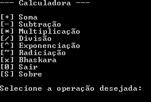
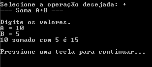

# **Projeto Final - Calculadora 2022** 📱​🔢​

## Projeto Final - Descrição 
O programa desenvolvido exibe uma lista de opções para a execução de cálculos mátemáticos básicos, como adição, subtração, multiplicação e divisão, também há opções de cálculos mais complexos, como exponenciação, radiciação e bháskara.

---

## Imagens do programa ​📷

### ✔️​ **Menu de opções:**


### ✔️​ **Demonstração - operação de soma:**



---

## _Download_ do arquivo ⏳​
Segue a baixo o link para fazer o download do arquivo, extraia na pasta de sua escolha.

[🎃  Projeto Final - Calculadora 2022 .zip](dist/calculadora-2022.zip)

Utilize o respectivo comando para efetuar o programa:

```
dotnet Projeto---Calculadora.dll
```
---

## Agradecimentos 👨​

- [Emorgenes Palacio](https://github.com/ermogenes)
- [Diego Neri](https://github.com/diegoneri) 
- [Etec Adolpho Berezin](http://eteab.com.br/cms/) 

